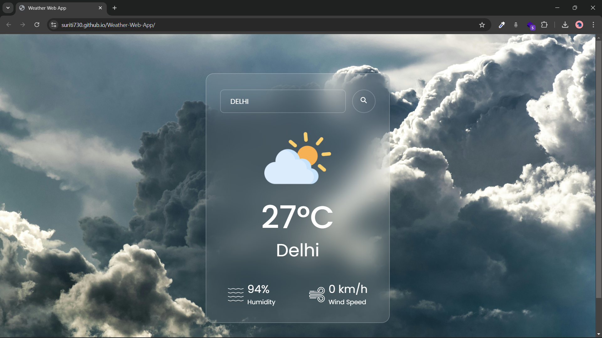

# Weather Web App 🌦️

This **Weather Web Application** allows users to check real-time weather conditions for any city using data from the **OpenWeatherMap API**. Built with **HTML**, **CSS**, and **JavaScript**, it offers a responsive and user-friendly interface.

## Screenshot 📸

Here’s a screenshot of the Weather Web App in action:



## Table of Contents 📖

1. [Features](#features)
2. [Tech Stack](#tech-stack)
3. [Live Demo](#live-demo)
4. [Installation](#installation)
5. [Usage](#usage)
6. [Project Structure](#project-structure)
7. [API Integration](#api-integration)
8. [Acknowledgements](#acknowledgements)

## Features ✨

- **Real-Time Weather Updates**: Displays the current temperature, humidity, and weather conditions for any city.
- **Search Functionality**: Type the name of any city to retrieve real-time weather data.
- **Responsive Design**: Adapts to different screen sizes for optimal viewing on desktop and mobile devices.
- **User-Friendly Interface**: Designed to be simple and intuitive.

## Tech Stack 🛠️

- **Frontend**: HTML5, CSS3, JavaScript (ES6+)
- **API**: [OpenWeatherMap API](https://openweathermap.org/)
- **Deployment**: [GitHub Pages](https://pages.github.com/)

## Live Demo 🚀

Check out the live demo of the application here: [Live Weather Web App](https://suriti730.github.io/Weather-Web-App/)

## Installation 🛠️

To run this project locally, follow these steps:

1. **Clone the repository**:
    ```bash
    git clone https://github.com/Suriti730/Weather-Web-App.git
    ```

2. **Navigate to the project directory**:
    ```bash
    cd weather-web-app
    ```

3. **Open `index.html` in your browser**:

    Simply open index.html in your browser or serve it using a local server (like Live Server extension in VS Code).
## Usage 📌

1. **Search a City**:
   - Enter the name of a city into the search box provided on the webpage and press enter or click the search button.

2. **View Weather Data**:
   - The app will retrieve and display the current weather conditions for the searched city. This includes:
     - **Temperature**: The current temperature in Celsius or Fahrenheit.
     - **Humidity**: The percentage of humidity in the air.
     - **Weather Description**: A brief description of the weather conditions (e.g., clear sky, light rain).

   Example:
   - If you search for "London," the app might display:
     - Temperature: 15°C
     - Humidity: 72%
     - Weather Description: Light rain

## Project Structure 📁

Here’s the structure of the project:

- **`index.html`**: The main HTML file that serves as the entry point of the web application.
- **`style.css`**: Contains the CSS styles for the web app to ensure it looks good and is responsive.
- **`script.js`**: Includes the JavaScript code for fetching data from the OpenWeatherMap API and updating the web page with weather information.
- **`assets/images/`**: Directory for storing images or other static assets used in the project.
- **`README.md`**: Provides an overview and documentation for the project.

## API Integration 🌐

This project uses the **OpenWeatherMap API** to fetch weather data. Follow these steps to set it up:

1. **Sign Up**:
   - Go to [OpenWeatherMap](https://home.openweathermap.org/users/sign_up) and create a free account.

2. **Obtain Your API Key**:
   - Once logged in, navigate to the API keys section of your dashboard and generate a new API key if you don’t have one already.

3. **Update API Key in Code**:
   - Replace the placeholder API key in your `script.js` file with your actual API key. Open `script.js` and update the following line:
     ```js
     const apiKey = 'YOUR_API_KEY_HERE';  // Replace this with your actual API key
     ```

4. **Verify API Integration**:
   - Ensure the API key is correctly placed and that your app is fetching and displaying data as expected.

## Acknowledgements 🙏

- [OpenWeatherMap API](https://openweathermap.org/) for providing the weather data.
- [GitHub Pages](https://pages.github.com/) for hosting the web app.
